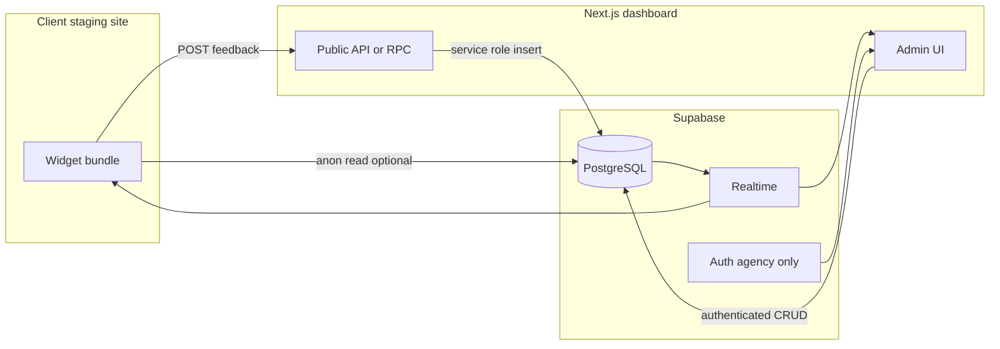

# AgencyFeedback — implementation plan

## Context

The project workspace started empty (greenfield). The PRD aligns with **Next.js + Supabase**; the main design choices are **how anonymous clients write feedback safely** and **how projects are registered**.

## Architecture (high level)



**Recommendation:** Keep **one repository** with:

- Next.js App Router app (dashboard + optional marketing later).
- Widget source in a `widget/` folder (TypeScript), built with **esbuild** (or Vite library mode) to a single **IIFE** file copied to `public/agency-feedback.js` (or a versioned filename).

Agency embeds:

```html
<script
  src="https://your-dashboard-host/agency-feedback.js"
  data-project="frapin-malaysia"
  data-api="https://your-dashboard-host"
  defer
></script>
```

## Data model (extend PRD slightly)

The PRD’s flat `project_id` slug is fine for the widget, but the dashboard needs a **`projects`** table so you can list sites, store **staging base URL**, and gate writes.

| Table | Purpose |
| ----- | ------- |
| `projects` | `id` (uuid), `slug` (unique, e.g. `frapin-malaysia`), `name`, `staging_base_url` (origin + optional default path), `embed_public_key` (random secret per project), `created_at` |
| `feedback` (or `pins`) | PRD fields, plus **`status`**: `open`, `in_progress`, or `resolved` (instead of only `is_resolved`), optional **`priority`**: `low`, `medium`, `high`, **`url_path`** (text) for deep links, **`project_id`** as uuid FK → `projects.id` |

**Indexes:** `(project_id, status, created_at desc)`, `(project_id, url_path)` for filtering.

## Security: anonymous clients vs agency staff

- **Agency:** Supabase Auth (email magic link or password). Dashboard uses the **user session**; only authenticated users can read/update/delete across projects (MVP: all staff see all projects; later add `project_members`).
- **Clients (no login):** Do **not** expose a policy like “anyone can insert into `feedback`” using only the anon key.

**Preferred MVP pattern:** **Next.js Route Handler** e.g. `app/api/public/feedback/route.ts` that:

1. Accepts JSON: `projectSlug`, `embedPublicKey`, `selector`, `coordinates`, `comment`, `author`, `metadata`, `priority`, `urlPath`, `status` (default `open`).
2. Looks up `projects` where `slug` + `embed_public_key` match.
3. Inserts into `feedback` using a **Supabase service role** server client (env-only, never shipped to browser).

**Alternative:** `submit_feedback` Postgres RPC (`SECURITY DEFINER`) that validates slug + key inside the DB; widget calls Supabase REST/RPC with anon key. Slightly more “Supabase-native” but more SQL/RLS work for the same outcome.

**Reads for widget (show existing pins on page):** Either:

- Same public API `GET` with slug + key (simplest with one security model), or
- Supabase **anon SELECT** with RLS. For MVP, **GET via the same route handler** keeps one place for auth.

## Widget behavior (Phase A)

1. **Toggle:** Floating button (or keyboard shortcut); “comment mode” changes cursor and ignores clicks on the widget UI only (`pointer-events` on overlay root).
2. **Click to pin:** On `click` in mode, `event.target` → compute **robust CSS selector** (walk up to `body`, use tag + `nth-of-type` / `nth-child`, optional stable `data-*` if present). Store **percentage coordinates** `{ x, y }` relative to **element bounds** (clientX/Y vs `getBoundingClientRect()`), clamp 0–1.
3. **Context:** `navigator.userAgent`, `navigator.platform` or UA-CH if you add later, `window.innerWidth` / `innerHeight`, full path `location.pathname + location.search` (and optionally hash stripped for stability).
4. **Modal:** Name, message, priority; POST to public API.
5. **Render pins:** After load, fetch open pins for this `urlPath` (and project); for each, `document.querySelector(selector)` if found, place absolutely positioned marker at `%` within element; on `resize`/`scroll`, recompute (use `requestAnimationFrame` debounce). If selector fails, fallback to **last known viewport-absolute** position stored in metadata (optional column) to avoid total loss—nice-to-have for V1.1.
6. **Resolved state:** Poll or Realtime: when status becomes `resolved`, hide pin or style green per PRD.

## Realtime (PRD)

- Enable Supabase **Realtime** on `feedback`.
- **Dashboard:** `postgres_changes` on `feedback` (filter by `project_id` when viewing a project).
- **Widget:** subscribe while page open so pins update live (same filter + `url_path` if you want fewer events).

## Dashboard (Phase B)

- **Auth pages:** sign-in; protect `/` or `/dashboard` with middleware checking Supabase session.
- **Projects:** CRUD minimal—create slug, name, staging URL, show **embed snippet** including regenerated `embed_public_key` if rotated.
- **Comment feed:** Table or list with filters: project, status, optional priority; sort by date; inline actions to set status (Open / In progress / Resolved).
- **Deep link:** Store `url_path` on each row. Dashboard “Open on site” builds:  
  `staging_base_url.replace(/\/$/, '') + url_path + '?af_pin=' + feedback.id`  
  (query name is arbitrary; keep consistent.) Widget on load parses `af_pin`, scrolls element into view, highlights pin.

## Notifications (user flow vs MVP)

PRD mentions Slack/email in the flow; treat **V1 as dashboard + realtime only**. Add **V1.5** outbound webhook or Supabase Edge Function + Slack Incoming Webhook when you want parity with the narrative.

## V2/V3 (roadmap alignment)

- **V2:** `html2canvas` (or `modern-screenshot`) in widget, upload to Supabase Storage, store `screenshot_path` on `feedback`.
- **V3:** Outbound integration worker (queue table or Edge Function) to Notion/ClickUp.

## Implementation checklist

1. Supabase project: create tables, indexes, enable Realtime; add **service role** secret to Next.js env.
2. Next.js scaffold: App Router, Supabase SSR auth helpers (`@supabase/ssr`), protected layout for admin.
3. Public API route: validate project key, insert/list feedback for widget.
4. Widget package + build script; document embed snippet.
5. Dashboard UI: projects, feed, status updates, deep-link button.
6. Wire Realtime on feed + optional widget subscription.
7. Polish: white-label CSS variables, pin numbering, mobile viewport testing.

## Risk notes

- **Selector stability:** No selector survives all DOM changes; percentages + path help. Document limitation for clients.
- **Cross-origin:** Widget runs on **client staging origin**; API on **dashboard origin** → must enable **CORS** on `POST/GET /api/public/feedback` for allowed origins or `*` for MVP staging (tighten later).
- **Google Drive as project root:** Some tools struggle with sync paths; prefer a normal disk path or ensure Next/Node file watching works in your environment.

## Prerequisites

- A **Supabase** project (URL + anon key + service role key).
- Chosen **dashboard host** (e.g. Vercel) for `data-api` and script `src` URLs.
